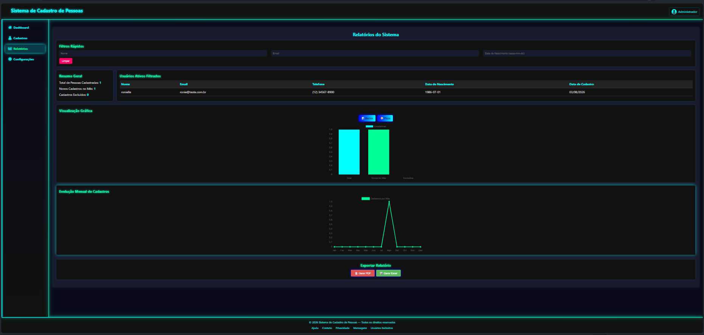

# 📋 CRUD de Cadastro de Pessoas


- 📊 Relatórios completos com filtros por nome, e-mail e data de nascimento  
- 📈 Visualização gráfica de cadastros (total, novos no mês e excluídos)  
- 📅 Evolução mensal dos cadastros em gráficos de linha  
- 📤 Exportação de relatórios em PDF e Excel  
- 📧 Envio automático de relatórios por e-mail  

---

## 📸 Demonstração



---

## 🚀 Tecnologias
- **Front-end:** React + Vite  
- **Back-end:** Node.js + Express  
- **Banco de dados:** SQLite  
- **Controle de versão:** Git & GitHub  

---

## ⚙️ Funcionalidades
- ✅ Cadastrar nova pessoa  
- ✅ Listar pessoas cadastradas  
- ✅ Editar dados de uma pessoa  
- ✅ Excluir pessoa  

---

## 📂 Estrutura do projeto
```Cadastro/
├── backend/        # API em Express + SQLite
├── frontend/       # Aplicação React
├── database.db     # Banco de dados local
├── README.md       # Documentação do projeto
└── .gitignore      # Arquivos ignorados pelo Git
```


---

## ▶️ Como rodar o projeto

### Back-end
```bash
cd backend
npm install
node server.js
```

### Front End
```Bash
cd frontend
npm install
npm start
```

---
📢 Observação
Este repositório é público e pode ser usado como referência de estudo.
Fique à vontade para clonar, testar e sugerir melhorias!

✨ Autor
Desenvolvido por Ronielle Leite
